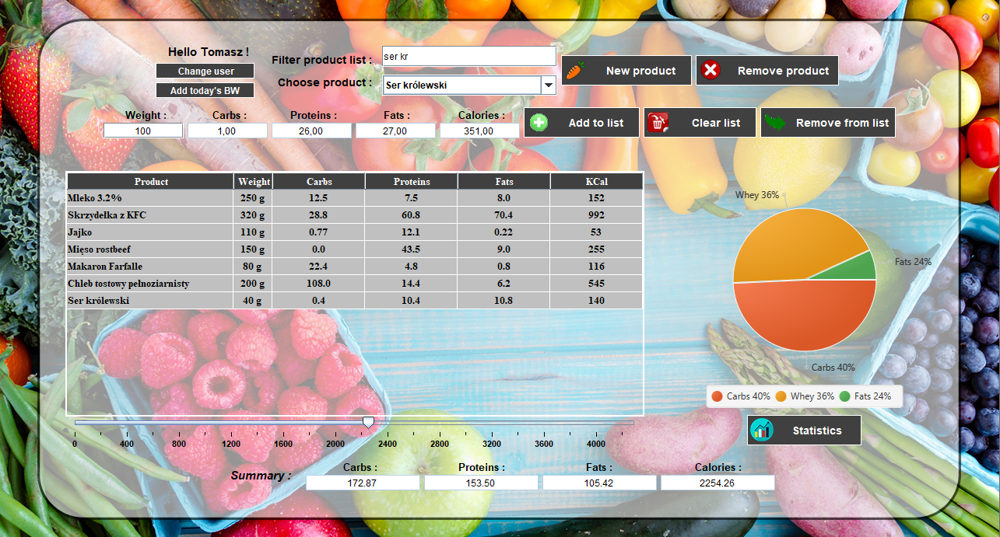
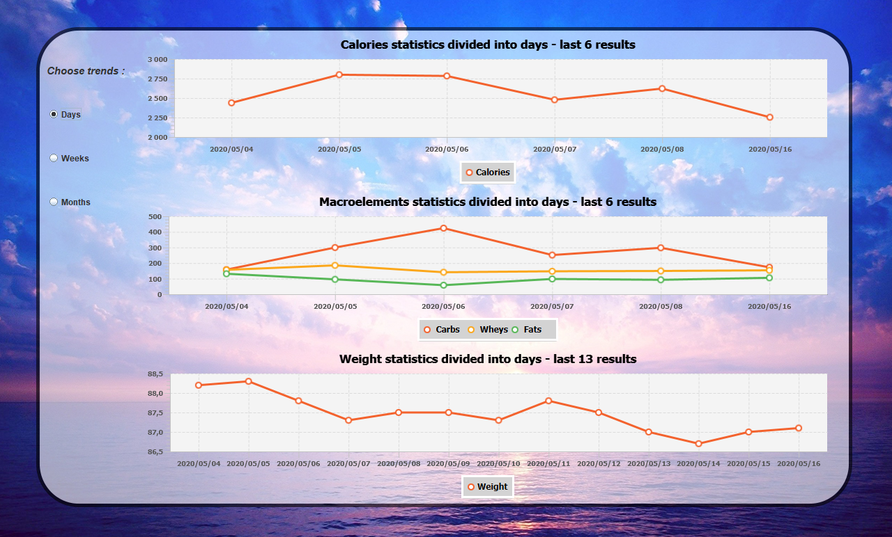
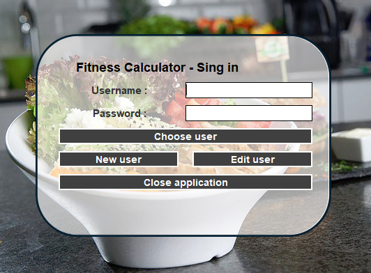

# Fitness Ccalculator v.2.1
Fitness Calculator - Desktop Application written in Java language. The main goal was to enable 
the user to create his own product database, so user can add his own products 
that he uses everyday without having to search for similar products that differ from each other.

- - - - - - - - - - - - - - - - - - - - - - - - - - - - - - - - - - - - - - - - - - - - - - - -

Functionalities : 
- create own profile with daily calories goal
- editing profile ( new username or password or daily calories goal )
- adding consumed products
- adding new products to own product list
- adding daily body weight
- filtering text panel - to search product from list faster
- calories slider, pie-chart and summary panel to follow user's daily intake
- products are divided into macronutrients to follow user's diet goals ( carbohydrates / proteins / fats )
- statistics panel to follow users progress ( weight, calories, macroelements ), 
where user can divide the results into days/weeks/months
- users password is Encoded by BCrypt Spring Security 

- - - - - - - - - - - - - - - - - - - - - - - - - - - - - - - - - - - - - - - - - - - - - - - -

